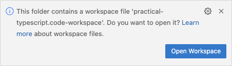

# Practical TypeScript

TypeScript fundamentals for single-page applications and web services - Lab Repository

## License to Use

This lab environment is made available for personal for participants in the Practical TypeScript course and other licensed partners.
The repository and contents are protected by copyright and may not be forked, copied, transfered, reproduced in any form, or altered other than for personal use as a participant.

## Introduction

TypeScript (https://typescriptlang.org) is an extension of the JavaScript language.
TypeScript adds to JavaScript:
* Strongly type variable and function declarations
* Public and private class members
* Type and interface declarations
* Enumerated Types

No prior knowledge of JavaScript is required to complete these labs.
This course focuses on TypeScript.
TypeScript minus strong typing is pretty much JavaScript, so learn JavaScript at the same time!
All that is needed are basic programming skills.
C, C++, Pascal, PHP, Python, Java, C#, and all other programming languages bring enough to the table to switfly adopt TypeScript.

Lab sequence:
1. Configure the Project
1. TypeScript Basics
1. Conditionals
1. Collections and Loops
1. Functions
1. Objects, Trees, and Modules
1. Interfaces and Classes
1. Document Object Model
1. Web Service
1. API Integration

## Using Codespaces & CodeTour

This project is designed to run in a Github Codespace, a virtual development environment.
To launch the virtual environment this repository must be copied (forked) into your own Github account.
When you get to the end of these steps and launch the Codespace, there will be a "taost notification" at the bottom right corner
of Visual Studio Codea asking if you want to open the workspace file.
You do, so click the button:

If you miss the toast notification that is OK, you will have a second chance to open the workspace file after Visual Studio Code completely
loads everything.

Configuration steps:

* Along the repository title bar above, click the *Fork* button and copy it into your personal organization space at GitHub.
* In your personal copy on the branch bar (main) click the *<> Code* button.
* In the pop-up click the *Codespaces* tab.
* Click the *Create codespace on main* button to launch the codespace.
* When Visual Studio Code opens and the toast notification pops up, click the *Open Workspace* button to open the workspace file.
* If you miss the toast notification, there will be another chance to open the workspace file as soon as Visual Studio Code finishes loading everything.

If you closed the codespace and want to reopen it from your Github account, click the "hamburger" menu at the upper
left corner of the GitHub page and select *Codespaces* to manage your codespaces.

Codespaces does not alter the repository in your Github account, even when you are making changes to the project.
Those changes only exist in Codespace, may be copied out, and may be pushed to a Git repository.
If you create a new Codespace from your forked repository, it will be clean on startup.

## Authors or Acknowledgments

* Joel Mussman

 Copyright &copy; 2024 NextStep IT Training, powered by Smallrock. All rights reserved. 
TypeScript Language Copyright &copy; 2012-2024 by Microsoft (see https://typescriptlang.org).